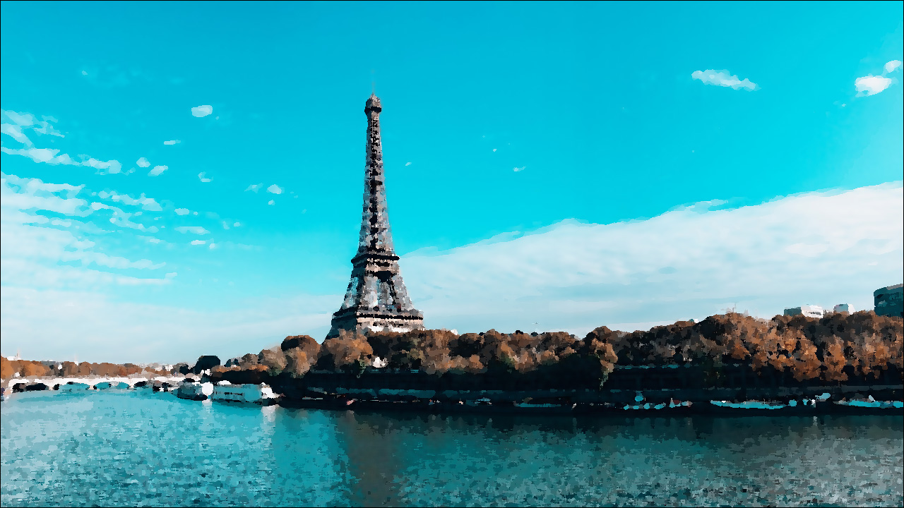

# CMPT461 Project: Paint Style Image Filter

> This project implements an image filter to transfer images into painting style.

For this paint filter, four types of styles are used: Chiaroscuro style, Gouache style, Landscape style, and Pastel style. 
For each paint style, two parameters are manually tuned: the radius that controls paint brush size, and the colour tank size that controls the level of colours preserved. 

Set Up
-----------------------------------------------------

Clone and compile the code. You will require java 18 to run the program.

To **Setup Output and Input Paths**, under Demo.java set 

    input_path ="..."
    out_path="...";

to the correct directory.

Sample Outputs
-----------------------------------------------------
| Original Image                              | Output                                                  |   
| ------------------------------------------- | ------------------------------------------------------- | 
|    | |
|          |       |
|        |           |
|      |   |
|    | |
|    | |
|        |       |
|        |     |
|          |       |
|      |   |
|              |             |

Supplimentary Material
-----------------------------------------------------
* Explanatory YouTube Video - [PaintFilter](https://www.youtube.com/watch?v=5o978yX_B_0)

## Authors

* Jason Lin - [Jason](tba)
* Bing Zhang - [BingQZh](https://github.com/BingQZh)

## Acknowledgements

- **[Prof. Aksoy](http://yaksoy.github.io/)
- ** TA Chris Careaga, Sebastian Dille
