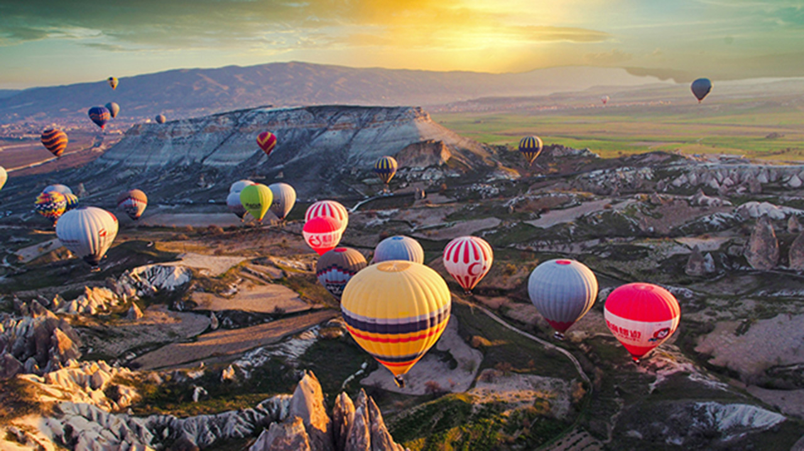

# CMPT461 Project: Paint Style Image Filter

> This project implements an image filter to transfer images into painting style.

Set Up
-----------------------------------------------------

Clone and compile the code. You will require java 18 to run the program.
To **Setup Output and Input Paths**, under Demo.java set 

    input_path ="..."
    out_path="...";

to the correct directory.

Sample Outputs
-----------------------------------------------------
| Original Image                              | Output                                                  |   
| ------------------------------------------- | ------------------------------------------------------- | 
|    | |
|       |       |
|      |           |
|     |   |
